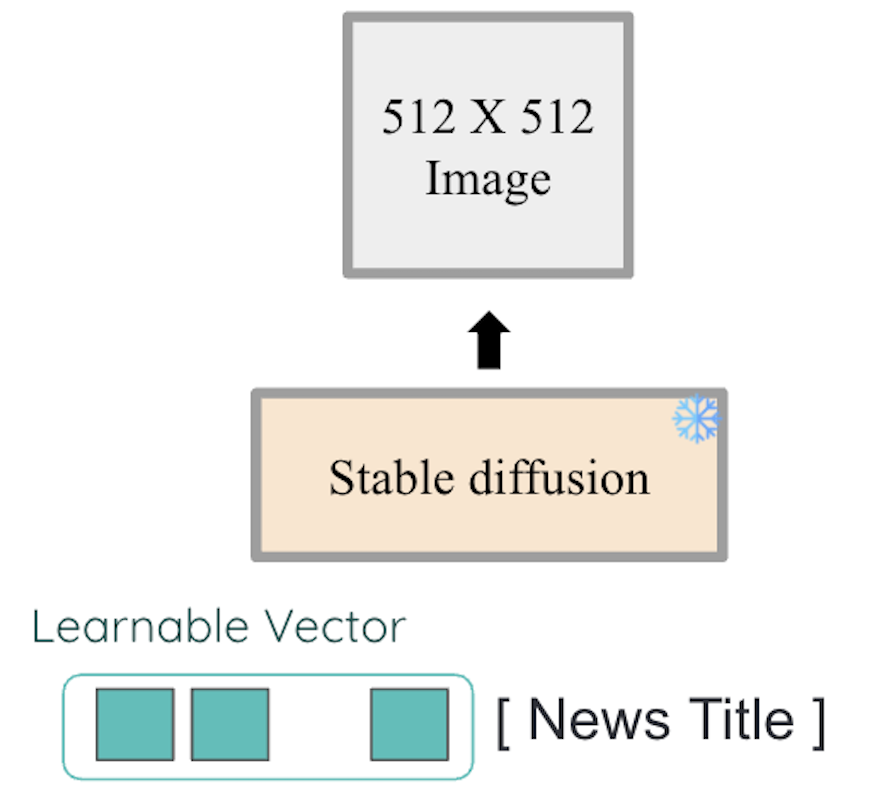
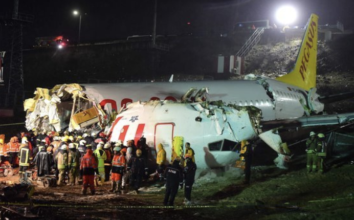
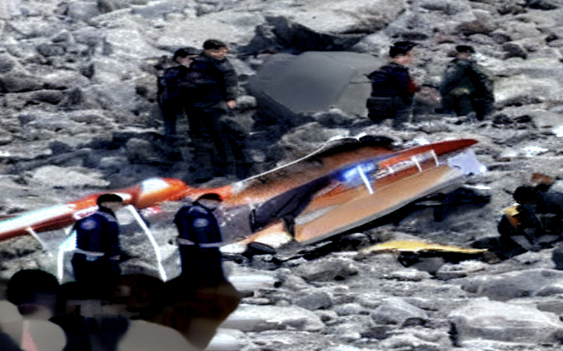
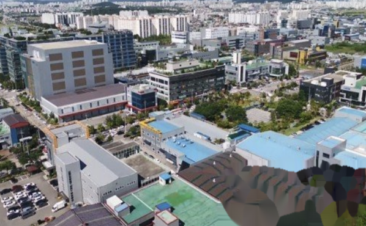

# MmoRPG
Multi-modal Realistic Picture Generation for news

<br>

## Dataset

__How to collect__
1. Collect 100K __Korean__ news data in [nate news](https://news.nate.com/)
    * _2020.01.01_ ~ _2022.12.31_
<br>

2. Exclude
    * 3 Topics: Entertainment, Politics, Sports
    * Short articles
    * English articles
    * Articles that have <u>No or low</u> relevant image
    * Articles that have <u>gif</u> image
<br>

3. Preprocessing
    * Remove <u>watermarks</u>
    * Text preprocessing
<br>

### Dataset example
1. about 100K dataset
    * upload on __Google Drive__
    * [Dataset for Korean news in nate(100K)](https://drive.google.com/file/d/16MYgiQS_jaAQ1gX7zMowOmuE-eMSVtb0/view?usp=sharing)
    * dataset before removing watermarks & gif images
    * form )
        ```
        “data”: {
            “id”        : str   // YYYYmmdd + Article Number
            “topic”     : str   // Article topic
            “text”      : str   // Title [SEP] Content
            “img”       : str   // Directory of image file
            “img_url”   : str   // Original image link
            “url”       : str   // News link
        }
        ```
<br>

2. about 100K dataset
    * upload on __Huggingface__
    * Seperated by topics
    * Done all preprocessing
    * Dataset only with __image__ and __news title__

        |   Topic    |Number|
        |------------|------|
        |  [Economy](https://huggingface.co/datasets/angdong/nate-news-economy)   | 25K  |
        |  [Society](https://huggingface.co/datasets/angdong/nate-news-society)   | 18K  |
        |[IT / Science](https://huggingface.co/datasets/angdong/nate-news-science)| 16K  |
        |   [World](https://huggingface.co/datasets/angdong/nate-news-world)    | 26K  |
        |   Total    | 95K  |

    
<br>

## Model

### Model structure


### Train
* Backbone model: stable diffusion([Rombach _et al_.](https://arxiv.org/pdf/2112.10752.pdf))
* __Prompt tuning__: Make a learnable prompt (__Topic__)  and train the vector while freezing the backbone
* train with text (_news title_) and image (_news image_) pairs

<br>

## Result

* 세 동강 난 터키 여객기, 사망자 3명…조종사 한국인 아니다 ([link](https://news.nate.com/view/20200206n20499))

|Original image|Generated image|
|-|-|
|||

<br>

* 중국에서 부품 안 들어와 공장 문 닫게 생겼어요 ([link](https://news.nate.com/view/20200211n10958))

|Original image|Generated image|
|-|-|
|||

<br>

* 모스크바 겨울철 이상 온난… “영상 4.3도, 140년만의 최고치” ([link](https://news.nate.com/view/20200118n00299))

|Original image|Generated image|
|-|-|
|||
